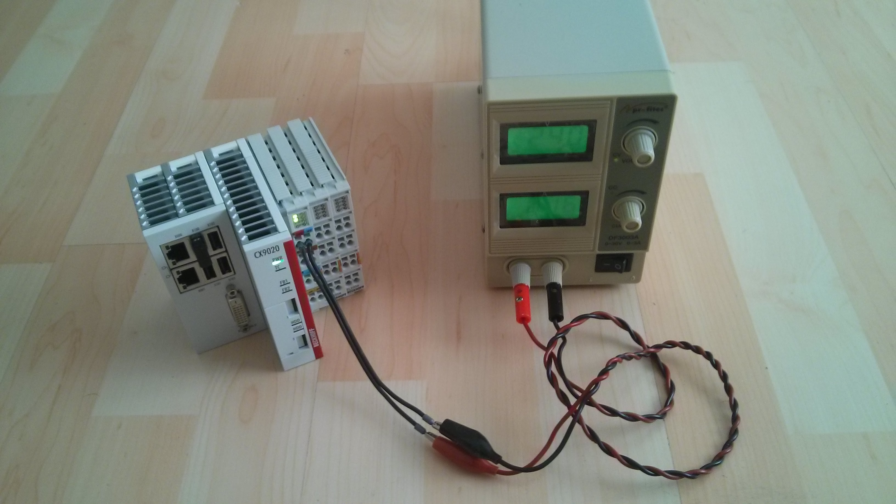
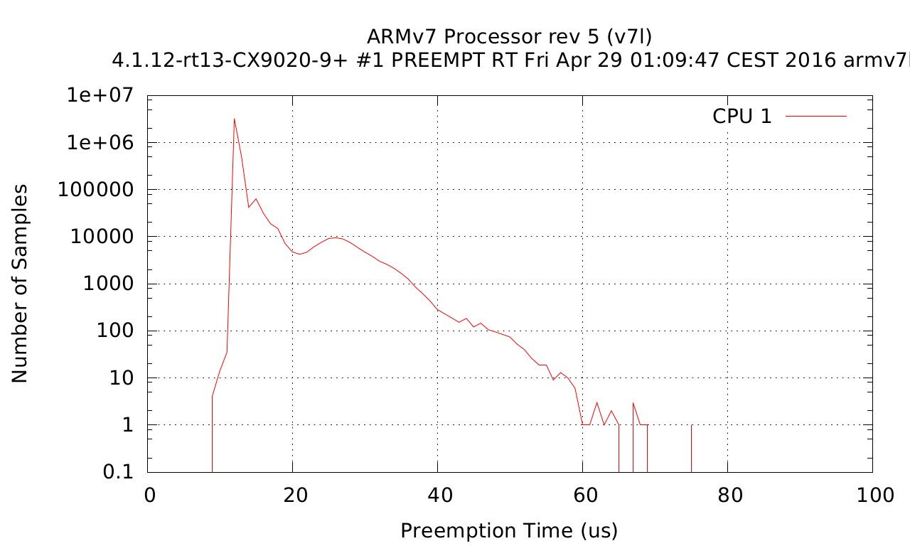

[Machinekit](http://www.machinekit.io/) + [Debian/Jessie](https://www.debian.org/releases/jessie/) on [Beckhoff CX9020](http://www.beckhoff.de/english.asp?embedded_pc/cx9020.htm).
 
### Overview

The CX9020 comes in different configurations, to get Linux running, you need to order the variant CX9020-0100, which is pre-configured to boot directly from the microSD card instead of using the internal bootloader. This variant is therefore suitable for operating systems with bootloaders on microSD cards (like Linux).

#### Specs

The CX9020 is a DIN rail-mountable embedded system
*   1 GHz ARM Cortex™-A8 CPU
* 512 MB microSD  (optionally expandable) flash memory, 2 microSD card slots
*   1 GB DDR3 RAM (non expandable) internal main memory
* 128 KB NOVRAM   (integrated) persistent memory
* 2 x RJ45 10/100 Mbit/s
* 1 x DVI-D
* 4 x USB 2.0
* 1 x optional interface

* Photos: [Hardware](https://goo.gl/photos/kc86sjNKajbgcdEr7)

### Cross-compile RT-PREEMPT Linux kernel and setup a Debian/Jessie rootfs

Beckhoff has published shell scripts and patches at [github.com/Beckhoff/CX9020](https://github.com/Beckhoff/CX9020) to build a basic Linux system image. As of 2016-05-01 the scripts require an Ubuntu 14.04 LTS installation. I've tried the installation on an Ubuntu 16.04 installation and ran into a small problem with sfdisk. So for now, the Ubuntu 14.04 LTS installation is the recommended way of building the system image.

The system image build process requires about 2.65 GB hdd space available on the build host. Follow the instructions at [github.com/Beckhoff/CX9020](https://github.com/Beckhoff/CX9020):
```bash
# prepare your machine f.e.: 64-bit Ubuntu 14.04 LTS would require
sudo dpkg --add-architecture i386
sudo apt-get update
sudo apt-get install -y multistrap qemu binfmt-support qemu-user-static mercurial libtool autoconf lib32z1 lib32ncurses5-dev lib32stdc++6 git make xz-utils bc wget

# fix multistrap bug in Ubuntu 14.04
sudo sed -i "s/\$forceyes //" /usr/sbin/multistrap

git clone https://github.com/Beckhoff/CX9020
cd CX9020
./tools/install_linaro_gcc.sh

# get and patch the u-boot sources
./tools/prepare_uboot.sh v2015.07

# build u-boot
make uboot

# get and patch a rt kernel
./tools/prepare_kernel.sh 4.1 12 13

# configure and build the kernel
make kernel

# get and patch etherlab (optional)
./tools/prepare_etherlab.sh

# configure and build the etherlab (optional)
make etherlab

# prepare sdcard with a small debian rootfs
#
# BE CAREFUL to specify the correct device name,
# or you might end up deleting your host's root partition!
./scripts/install.sh /dev/sdc

# install etherlab (optional)
./scripts/52_install_etherlab.sh /tmp/rootfs
```
You now have a Linux 4.1.12-rt13 + Debian/Jessie base system image.

Make a backup of the system image (optional, but recommended):
```bash
sudo dd if=/dev/sdc of=CX9020.img
```

Insert the microSD card into the first microSD card slot of the CX9020. Power on the system, the red power led turns yellow, and after about 2 secs, the power led should turn green:

My power supply's readouts: 24.0V / 0.16A.

The first  ethernet interface is pre-configured with a DHCP client.
The second ethernet interface is pre-configured with a static IP.
See: https://github.com/Beckhoff/CX9020/blob/master/tools/eth0.cfg

### CX9020 post configuration tasks

#### Setup sshd remote login public ssh key

On the CX9020 add to ```/root/.ssh/authorized_keys``` your ssh public key.

#### Configure ssh client on Laptop

To ssh login as user root to the CX9020, I added to my Thinkpad's ```~/.ssh/config```:
```
Host cx9020
 Hostname cx9020.local
 User root
 IdentitiesOnly yes
 ForwardX11 no
 IdentityFile ~/.ssh/id_rsa.pub
```

First login:
```bash
$ ssh cx9020.local
```
uname:
```bash
root@CX9020:~# uname -a
Linux CX9020 4.1.12-rt13-CX9020-9+ #1 PREEMPT RT Fri Apr 29 01:09:47 CEST 2016 armv7l GNU/Linux
```
CPU:
```bash
root@CX9020:~# cat /proc/cpuinfo 
processor	: 0
model name	: ARMv7 Processor rev 5 (v7l)
BogoMIPS	: 66.66
Features	: half thumb fastmult vfp edsp thumbee neon vfpv3 tls vfpd32 
CPU implementer	: 0x41
CPU architecture: 7
CPU variant	: 0x2
CPU part	: 0xc08
CPU revision	: 5

Hardware	: Freescale i.MX53 (Device Tree Support)
Revision	: 0000
Serial		: 0000000000000000
```
Memory:
```bash
root@CX9020:~# cat /proc/meminfo 
MemTotal:        1029288 kB
MemFree:          379604 kB
MemAvailable:     979304 kB
Buffers:           15680 kB
Cached:           526620 kB
SwapCached:            0 kB
Active:           250864 kB
Inactive:         301416 kB
Active(anon):      10080 kB
Inactive(anon):    13596 kB
Active(file):     240784 kB
Inactive(file):   287820 kB
Unevictable:           0 kB
Mlocked:               0 kB
HighTotal:        524288 kB
HighFree:         197844 kB
LowTotal:         505000 kB
LowFree:          181760 kB
SwapTotal:             0 kB
SwapFree:              0 kB
Dirty:                 8 kB
Writeback:             0 kB
AnonPages:          9996 kB
Mapped:             8384 kB
Shmem:             13696 kB
Slab:              91300 kB
SReclaimable:      85868 kB
SUnreclaim:         5432 kB
KernelStack:         632 kB
PageTables:          492 kB
NFS_Unstable:          0 kB
Bounce:                0 kB
WritebackTmp:          0 kB
CommitLimit:      514644 kB
Committed_AS:      50100 kB
VmallocTotal:     499712 kB
VmallocUsed:        2284 kB
VmallocChunk:     493436 kB
CmaTotal:          16384 kB
CmaFree:           15336 kB
```
lshw:
```bash
root@CX9020:~# lshw -short
H/W path  Device  Class      Description
========================================
                  system     Freescale i.MX53 based Beckhoff CX9020
/0                bus        Motherboard
/0/0              processor  cpu
/0/1              memory     1005MiB System memory
/1        usb1    bus        EHCI Host Controller
/1/1              bus        USB 2.0 Hub
/2        eth0    network    Ethernet interface
```
lsmod:
```bash
root@CX9020:~# lsmod
Module                  Size  Used by
pwm_imx                 4173  0 
uio_pdrv_genirq         3825  0 
uio                    10220  1 uio_pdrv_genirq
```

### Setup with a bigger microSD card

The 512 MB microSD card that comes with the CX9020 is a bit too small for a basic Linux development system.

There's several options:

* buy a bigger card from Beckhoff (certified for industrial use),
* mount a network filesystem to have more hdd capacity on the CX9020,
* etc.

I bought a 64 GB AFGA PHOTO micro SDXC card ([EAN 4250255102370](http://bfy.tw/5XsA)), copied the ```CX9020.img``` created during the backup step above onto the 64 GB microSD card and resized the root partition with GParted:
```bash
$ sudo dd if=CX9020.img of=/dev/sde # /dev/sde is the device file of the microSD card reader slot
$ sudo gparted /dev/sde
```
I re-inserted the 64 GB microSD card into the CX9020 and installed some packages:
```bash
root@CX9020:~# apt install htop wget screen vim vim-scripts emacs apt-file devscripts git
```
Disk space:
```bash
root@CX9020:~# df -h
Filesystem      Size  Used Avail Use% Mounted on
/dev/root        54G  775M   51G   2% /
devtmpfs        495M     0  495M   0% /dev
tmpfs           503M     0  503M   0% /dev/shm
tmpfs           503M   13M  490M   3% /run
tmpfs           5.0M     0  5.0M   0% /run/lock
tmpfs           503M     0  503M   0% /sys/fs/cgroup
```

#### modify /etc/fstab

From:
```
/dev/mmcblk0p1        /       auto             errors=remount-ro       0       1
```
to:
```
/dev/mmcblk0p1        /       auto    lazytime,errors=remount-ro       0       1
```

### Benchmark the RT-PREEMPT kernel with cyclictest

```bash
root@CX9020:~# apt install gnuplot libnuma-dev
```

```bash
git clone git://git.kernel.org/pub/scm/utils/rt-tests/rt-tests.git
cd rt-tests
make all
cp ./cyclictest /usr/bin/
```

```bash
root@CX9020:~# uname -a
Linux CX9020 4.1.12-rt13-CX9020-9+ #1 PREEMPT RT Fri Apr 29 01:09:47 CEST 2016 armv7l GNU/Linux
```

```bash
root@CX9020:~# cyclictest -t1 -p 80 -n -i 10000 -l 10000
# /dev/cpu_dma_latency set to 0us
policy: fifo: loadavg: 0.01 0.04 0.26 1/87 25906          

T: 0 (25906) P:80 I:10000 C:  10000 Min:     37 Act:   45 Avg:   47 Max:      70
```

```bash
root@CX9020:~# time cyclictest -n -q -p 99 -a -t -D 1000 -i 250 -h 2000 -m > cyclictest-`uname -r`.plt
real    16m40.139s
user    0m3.600s
sys     0m53.870s
```
Generate histogram plot ```cx9020-cyclictest-4.1.12-rt13-CX9020-9+.pdf```:
```
root@CX9020:~# ./cyclictest_plot.sh cyclictest-`uname -r`.plt 100 
```
cyclictest result:


For comparison see:

* https://rt.wiki.kernel.org/index.php/Cyclictest
* https://docs.emlid.com/navio/Downloads/Real-time-Linux-RPi2
* https://github.com/machinekit/machinekit/issues/792

### Machinekit Setup

The Machinekit setup is pretty straight forward – just compile Machinekit from source or install the armhf Debian packages provided by http://deb.machinekit.io/debian/dists/jessie/ .

The config files for my CNC mill are hosted in the cx9020 branch at: https://github.com/koppi/mk/tree/cx9020/linuxcnc/configs/koppi-cnc .

With https://github.com/koppi/mk/blob/cx9020/linuxcnc/configs/koppi-cnc/systemd-register.py the mklauncher.service gets registered with systemd, which takes care to start mklauncher at bootup. Simply connect to the CX9020 via MachinekitClient. You should then be able to start / stop the CNC and interact with the CNC via the the Cetus GUI.

### ChangeLog

* 2016-05-27 – [Video](https://www.youtube.com/watch?v=Xs5yllN3u6Q) with [siggen HAL component test](https://github.com/koppi/mk/tree/master/linuxcnc/configs/cx9020-siggen).
* 2016-05-03 – Status of the machinekit-rt-preempt Debian package on armhf ([Issue #928](https://github.com/machinekit/machinekit/issues/928)).
* 2016-05-02 – Initial tests with Machinekit.
* 2016-05-01 – 64 GB microSD card + cyclictest.
* 2016-04-30 – First steps at running Debian/Jessie.

### Contact

If you have any questions about the setup process feel free to join the [](https://gitter.im/koppi/mk?utm_source=badge&utm_medium=badge&utm_campaign=pr-badge&utm_content=badge).
