# Machinekit on a Thinkpad X200 with Debian Jessie and Xenomai

This document describes the setup of [Machinekit](https://github.com/machinekit/machinekit) on a [Thinkpad X200](http://thinkwiki.de/X200) running [Debian/Jessie](https://www.debian.org/releases/jessie/) with a Xenomai real-time kernel. This setup is used to control a CNC machine with Beckhoff EtherCAT components.

## Changelog

*   **2016-04-19:** Successfully tested [MachinekitClient](https://github.com/strahlex/MachinekitClient).
    *   Server: [Machinekit](https://github.com/machinekit/machinekit), [QtQuickVcp](https://github.com/strahlex/QtQuickVcp), [Cetus](https://github.com/strahlex/Cetus), and [mklauncher](https://github.com/machinekit/machinekit/blob/master/src/machinetalk/mklauncher/mklauncher.py) on Debian/Jessie x64 (Thinkpad X200).
    *   Client 1: [MachinekitClient](https://github.com/strahlex/MachinekitClient) on Ubuntu 16.04 x64 (Thinkpad X220).
        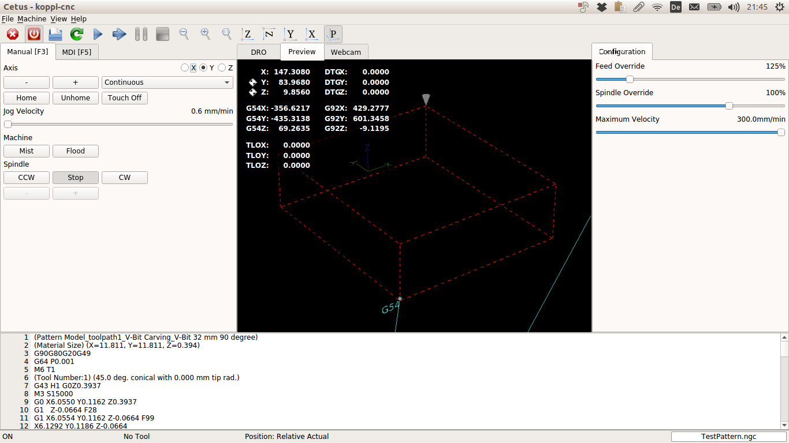
    *   Client 2: [Machinekit App](https://play.google.com/store/apps/details?id=io.machinekit.appdiscover) on Android 5.0 (Nexus 4).
        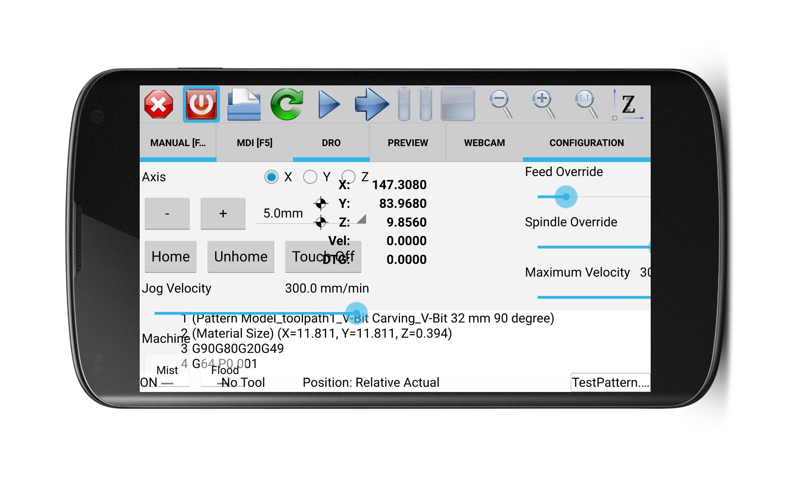
    *   Config files for this setup are in the `mklauncher` branch: https://github.com/koppi/mk/commits/mklauncher

*   **2015-05-30:** [Current version based on Debian/Jessie](https://github.com/koppi/mk/blob/master/Machinekit-Xenomai-Thinkpad-X200.md)
*   **2015-05-26:** [Older version based on Debian/Wheezy](https://github.com/koppi/mk/blob/daa3fd64a0b2b61933cdda100c8679dcee8232cb/Machinekit-Xenomai-Thinkpad-X200.md)

## System Overview

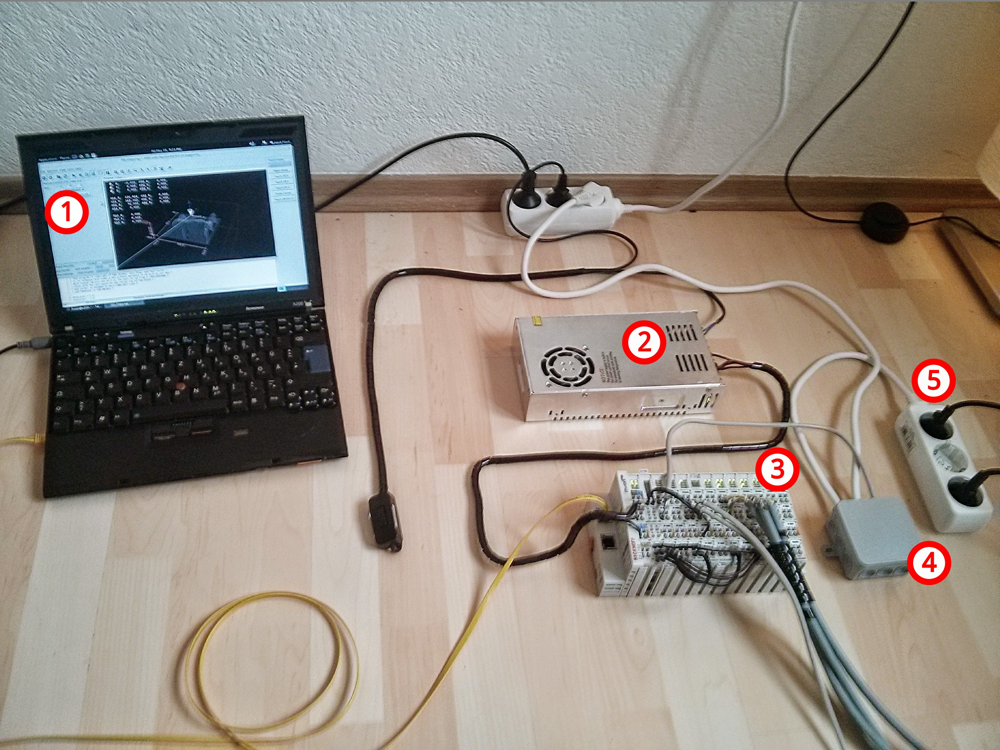

1.  **IBM Thinkpad X200:** Running Debian Jessie / Linux 3.8.1 / Machinekit 0.1 / Xenomai 2.6.4
2.  **24VDC 50W Power Supply**
3.  **Beckhoff EtherCAT Components**
4.  **SSR-40 DA Solid State Relay Module:** (Currently unused, replaced by an EL2622 terminal)
5.  **Power Supply for Kress Spindle / Vacuum Cleaner**

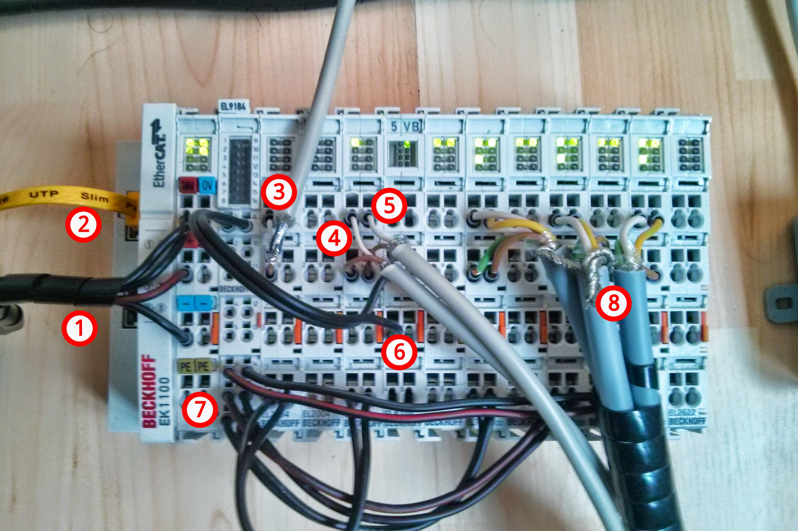

1.  **24V Power Supply Input**
2.  **Ethernet Cable:** From Thinkpad to EK1100 (EtherCAT Coupler)
3.  **Output 1 (EL2004):** To Solid State Relay Module
4.  **Input 1 (EL1004):** From Emergency Stop Button
5.  **Input 2 (EL1004):** From Touch Probe
6.  **24V Supply:** From EL9184 distribution terminal to EL9100 bus terminal
7.  **24V Supply:** For EL7041-1000 Stepper Motor Drivers
8.  **Stepper Motor Outputs**

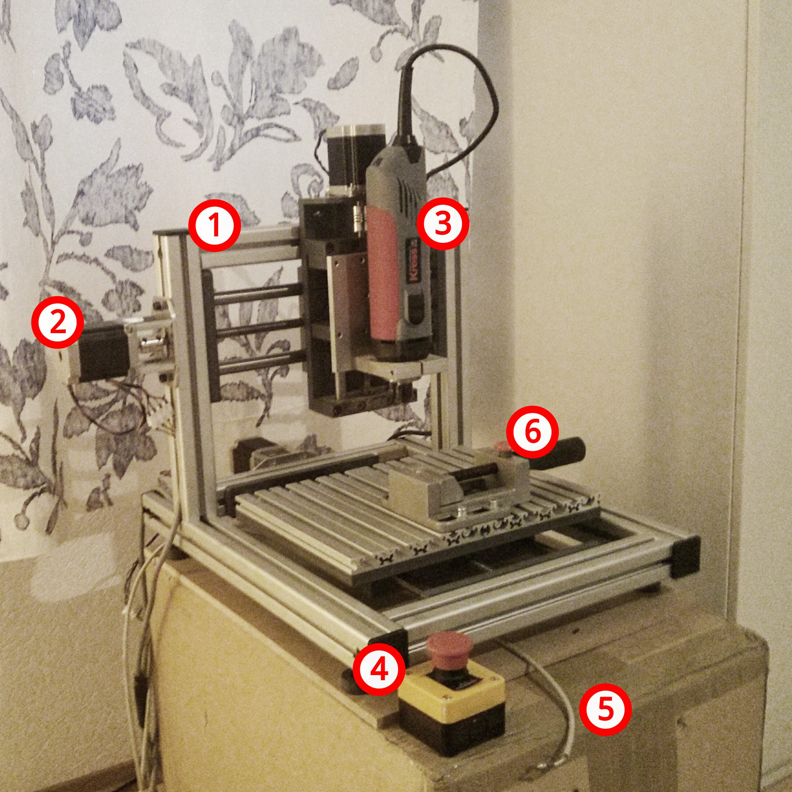

1.  **Small CNC Machine:** Portal 210 x 230 x 70
2.  **Nema23 Stepper Motor:** 57BYGH627 - Wantai
3.  **Kress 1050 FME-1 Spindle Motor**
4.  **Emergency Stop Push Button**
5.  **Touch Probe Input:** For tool length sensor
6.  **Machine Vise:** 60x65mm

## Videos

*   https://www.youtube.com/watch?v=0LI99cNjB_c
*   https://www.youtube.com/watch?v=2nGcliWefek
*   https://www.youtube.com/watch?v=F3YbdD2OPRA
*   https://www.youtube.com/watch?v=WRgyBxaeoAo

# Installation Guide

## 1. Thinkpad X200 BIOS Setup

First, reset the BIOS to factory settings.


Then, disable the "Legacy USB" support in the BIOS. This can help with real-time performance.


## 2. Debian Jessie Installation

Download the Debian Jessie 8.0.0 live ISO with non-free firmware.

```bash
# Primary URL
$ wget -c http://cdimage.debian.org/cdimage/unofficial/non-free/cd-including-firmware/8.0.0-live+nonfree/amd64/iso-hybrid/debian-live-8.0.0-amd64-gnome-desktop+nonfree.iso

# Archive URL if the primary fails
$ wget -c http://cdimage.debian.org/cdimage/unofficial/non-free/cd-including-firmware/archive/8.0.0-live+nonfree/amd64/iso-hybrid/debian-live-8.0.0-amd64-gnome-desktop+nonfree.iso
```

Verify the checksum against the official [MD5SUMS](http://cdimage.debian.org/cdimage/unofficial/non-free/cd-including-firmware/8.0.0-live+nonfree/amd64/iso-hybrid/MD5SUMS).

```bash
$ md5sum debian-live-8.0.0-amd64-gnome-desktop+nonfree.iso 
7a56cc2f78f8ea90d0c78fc462f95b95  debian-live-8.0.0-amd64-gnome-desktop+nonfree.iso
```

Write the ISO to a USB stick. **Warning: This will erase all data on the target device (`/dev/sdX`)**.

```bash
$ sudo dd if=debian-live-8.0.0-amd64-gnome-desktop+nonfree.iso of=/dev/sdX bs=4M status=progress
```

Install Debian from the USB stick and reboot.

## 3. Post-Installation System Configuration

### GDM3 Automatic Login

To enable automatic login for your user, edit the GDM3 configuration.

```bash
# Replace 'koppi' with your username
$ sudo sed -i "s|^#\?.*AutomaticLoginEnable.*|AutomaticLoginEnable = true|" /etc/gdm3/daemon.conf
$ sudo sed -i "s|^#\?.*AutomaticLogin .*=.*|AutomaticLogin = koppi\nTimedLoginEnable = true\nTimedLogin = koppi\nTimedLoginDelay = 0|" /etc/gdm3/daemon.conf
```

### Gnome Desktop Tweaks

These settings optimize the Gnome desktop for a CNC controller environment.

```bash
$ gsettings set org.gnome.desktop.background primary-color '#000000'
$ gsettings set org.gnome.desktop.wm.preferences titlebar-font 'Cantarell Bold 8'
$ gsettings set org.gnome.settings-daemon.plugins.power sleep-inactive-ac-timeout 0
$ gsettings set org.gnome.desktop.lockdown disable-lock-screen true
$ gsettings set org.gnome.settings-daemon.plugins.xrandr default-monitors-setup do-nothing
$ gsettings set org.gnome.SessionManager logout-prompt false
$ gsettings set org.gnome.desktop.interface cursor-blink false
$ gsettings set org.gnome.settings-daemon.peripherals.mouse middle-button-enabled true
$ gsettings set org.gnome.Terminal.Legacy.Settings confirm-close false
$ gsettings set org.gnome.desktop.interface enable-animations false
$ gsettings set org.gnome.settings-daemon.plugins.cursor active false
$ sudo sed -i "/title_vertical_pad/s/value=\"[0-9]\\{1,2\\}\"/value=\"0\"/g" \
    /usr/share/themes/Adwaita/metacity-1/metacity-theme-3.xml
```

### Disable Suspend on Lid Close

Edit the systemd logind configuration to ignore the lid switch.

```bash
$ sudo vi /etc/systemd/logind.conf
```

Change `#HandleLidSwitch=suspend` to:
```
HandleLidSwitch=ignore
```

Restart the service to apply the change.
```bash
$ sudo systemctl restart systemd-logind
```

### WLAN Configuration

Set up a static IP for the wireless interface by editing `/etc/network/interfaces`.

```ini
auto wlan0
allow-hotplug wlan0
iface wlan0 inet static
  address 192.168.0.3
  netmask 255.255.255.0
  gateway 192.168.0.1
  wpa-ssid "YOUR_SSID"
  wpa-psk "YOUR_PASSWORD"
```

Bring the interface up.
```bash
$ sudo ifup wlan0
$ /sbin/ifconfig wlan0
```

### Sudo without Password

Configure sudo to not require a password for your user group.

```bash
$ su -
# visudo
```

Change this line:
```
%sudo   ALL=(ALL:ALL) ALL
```
to:
```
%sudo   ALL=(ALL:ALL) NOPASSWD: ALL
```

Add your user to the `sudo` group.
```bash
# usermod -aG sudo koppi # replace 'koppi' with your user id
```
Log out and log back in for the group change to take effect.

### SSHD Configuration

To speed up SSH logins, disable DNS lookups on the server.
```bash
$ sudo sh -c 'echo "UseDNS no" >> /etc/ssh/sshd_config'
```

To suppress the "last login" message, create a `.hushlogin` file in your home directory.
```bash
$ touch ~/.hushlogin
```

## 4. Machinekit Installation

Follow the instructions from the [official Machinekit documentation](http://www.machinekit.io/docs/getting-started/installing-packages/).

### Configure Package Manager

Add the Machinekit package repository key and source list.
```bash
$ sudo apt-key adv --keyserver keyserver.ubuntu.com --recv 43DDF224
$ sudo sh -c \
  "echo 'deb http://deb.machinekit.io/debian jessie main' > \
    /etc/apt/sources.list.d/machinekit.list"
$ sudo apt-get update
```

### Install Machinekit Packages

Install the Xenomai kernel and the Machinekit packages.
```bash
$ sudo apt-get -y install linux-image-xenomai.x86-amd64 linux-headers-xenomai.x86-amd64
$ sudo apt-get -y install machinekit machinekit-xenomai machinekit-posix machinekit-dev
```

## 5. Linux / Xenomai Configuration

### GRUB Configuration

Edit `/etc/default/grub` to add kernel parameters required for Xenomai.
```ini
# Find this line:
# GRUB_CMDLINE_LINUX_DEFAULT="quiet"

# And replace it with this:
GRUB_CMDLINE_LINUX_DEFAULT="quiet xeno_nucleus.xenomai_gid=120 xeno_hal.smi=1 lapic=notscdeadline hpet=disable i915.i915_enable_rc6=0 i915.powersave=0 intel_idle.max_cstate=1 processor.max_cstate=1 isolcpus=1 idle=poll"
```
*   `xeno_nucleus.xenomai_gid=120`: Sets the group ID for Xenomai access. See [Running a Xenomai application as a regular user](http://xenomai.org/2014/06/running-a-xenomai-application-as-a-regular-user/).
*   The other parameters are for disabling power management features that can interfere with real-time performance.

Update the bootloader and reboot.
```bash
$ sudo update-grub
$ sudo reboot
```

During reboot, select the Xenomai kernel from the "Advanced Options" in the GRUB menu.

### Verify Kernel and Remove Old Kernel

After rebooting, verify that the Xenomai kernel is running.
```bash
$ uname -a
Linux x200 3.8-1-xenomai.x86-amd64 #1 SMP Debian 3.8.13-12~1jessie~1da x86_64 GNU/Linux
```

Once confirmed, you can remove the standard Debian kernel.
```bash
$ sudo apt-get -y remove --purge linux-image-amd64 linux-headers-amd64 linux-image-3.16.*-amd64 linux-headers-3.16.*-common linux-headers-3.16.*-amd64 linux-kbuild-3.16
```

### Check SMI Workaround

Check if the Xenomai SMI (System Management Interrupt) workaround is enabled.
```bash
$ dmesg | grep Xeno
[    0.632334] Xenomai: SMI-enabled chipset found
[    0.632346] Xenomai: SMI workaround enabled
...
```

### Xenomai Latency Test

Run the latency test for at least 10 minutes (24 hours is recommended for production systems).
```bash
$ sudo sh -c 'echo 0 > /proc/xenomai/latency'
$ timeout 600 xeno latency
```
Note the worst-case latency (`lat min` from the output, which is actually the max latency). Create an init script to set this value on boot. Multiply the value by 1000 (ns).

```bash
$ sudo nano /etc/init.d/xenomai-latency
```

Paste the following content, replacing `825` with your measured latency value.

```bash
#!/bin/sh -e
### BEGIN INIT INFO
# Provides:          xenomai-latency
# Required-Start:    xenomai
# Required-Stop:
# Default-Start:     2 3 4 5
# Default-Stop:      0 1 6
# Short-Description: Set /proc/xenomai/latency value
### END INIT INFO

FILENAME=/proc/xenomai/latency
# Replace with your measured max latency in nanoseconds (value * 1000)
LATENCY=8250

test -e $FILENAME || exit 0

case "$1" in
  start)
        echo "Setting Xenomai latency to $LATENCY"
        echo "$LATENCY" > $FILENAME
        ;;
  stop)
        ;;
  restart|force-reload)
        $0 start
        ;;
  *)
        echo "Usage: $0 {start|stop|restart|force-reload}"
        exit 1
        ;;
esac

exit 0
```

Make the script executable and enable it.
```bash
$ sudo chmod +x /etc/init.d/xenomai-latency
$ sudo update-rc.d xenomai-latency defaults
```

## 6. Machinekit User Configuration

Add your user to the `xenomai` and `kmem` groups.
```bash
$ sudo usermod -aG xenomai,kmem koppi # replace 'koppi' with your user id
```
Log out and log back in. Then run the Machinekit latency test.
```bash
$ latency-test
```

## 7. EtherCAT Master Installation

We will use the `ec-debianize` tool to build a Debian package for the IgH EtherCAT Master.

```bash
$ sudo apt-get -y install git debhelper gettext autoconf automake libtool dpatch libxenomai-dev
$ git clone https://github.com/sittner/ec-debianize
$ cd ec-debianize
$ ./debian/configure -r xenomai # Specify xenomai build
$ dpkg-checkbuilddeps
$ dpkg-buildpackage -b -uc
$ cd ..
$ sudo dpkg -i etherlabmaster_*.deb
$ sudo cp ec-debianize/debian/etherlabmaster/etc/init.d/ethercat /etc/init.d/ethercat
```

In `/etc/init.d/ethercat`, you may need to change the config file path from `/etc/sysconfig/ethercat` to `/etc/default/ethercat`.

Enable the service:
```bash
$ sudo update-rc.d ethercat defaults
```

Configure the master to use your Ethernet interface (`eth0`). Edit `/etc/default/ethercat`:
```bash
# Find your device with 'ifconfig' or 'ip a'
MASTER0_DEVICE="eth0"
# The driver for the NIC, e.g., e1000e for Intel gigabit
DEVICE_MODULES="e1000e"
```

Install NTP for time synchronization.
```bash
$ sudo apt-get -y install ntp
```

Add your user to the `ethercat` group.
```bash
$ sudo usermod -aG ethercat koppi # replace 'koppi' with your user id
```

Log out, log back in, and test the EtherCAT master.
```bash
$ sudo /etc/init.d/ethercat start
$ ethercat slaves
0  0:0  PREOP  +  EK1100 EtherCAT-Koppler (2A E-Bus)
1  0:1  PREOP  +  EL2004 4K. Dig. Ausgang 24V, 0.5A
2  0:2  PREOP  +  EL2004 4K. Dig. Ausgang 24V, 0.5A
3  0:3  PREOP  +  EL1004 4K. Dig. Eingang 24V, 3ms
4  0:4  PREOP  +  EL7041-1000 1K. Schrittmotor-Endstufe (50V, 5A, standard)
5  0:5  PREOP  +  EL7041-1000 1K. Schrittmotor-Endstufe (50V, 5A, standard)
6  0:6  PREOP  +  EL7041-1000 1Ch. Stepper motor output stage (50V, 5A, standard)
7  0:7  PREOP  +  EL2622 2K. Relais Ausgang, Schlie\u00df"er (230V AC / 30V DC)
```

## 8. LinuxCNC / EtherCAT HAL Module

Install the `lcec` HAL driver for Machinekit.

```bash
$ sudo apt-get -y install machinekit-dev
$ git clone https://github.com/sittner/linuxcnc-ethercat
$ cd linuxcnc-ethercat
$ dpkg-checkbuilddeps
$ dpkg-buildpackage -b -uc
$ cd ..
$ sudo dpkg -i linuxcnc-ethercat*.deb
```

## 9. Machinekit Configuration

Clone the configuration repository and link it.
```bash
$ cd ~
$ git clone https://github.com/koppi/mk
$ ln -s ~/mk/linuxcnc ~/linuxcnc
$ ln -s ~/mk/linuxcnc ~/machinekit
```

### Start AXIS UI

```bash
$ linuxcnc ~/linuxcnc/configs/koppi-cnc/koppi-cnc.ini
```

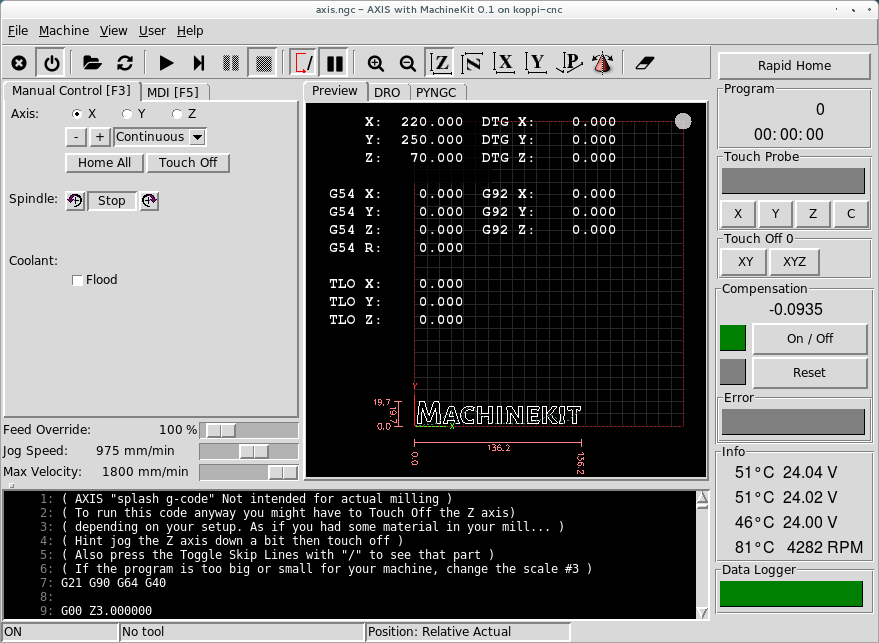

### Desktop Shortcut

```bash
$ ln -s ~/linuxcnc/configs/koppi-cnc/koppi-cnc.desktop ~/Desktop/koppi-cnc.desktop
```

## 10. Advanced Configuration & Tools

### Z-Axis Compensation Calibration

This setup uses a component to compensate for non-flat surfaces.

1.  Mount a touch probe.
    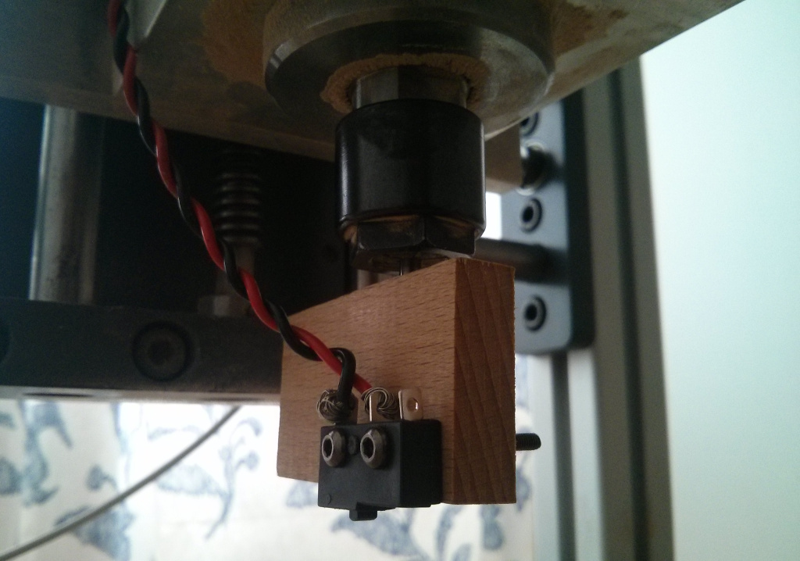
2.  In the AXIS UI, under the MDI tab, run the `scan_surface` O-code to probe the work area.
    ```gcode
    o<scan_surface> call [0][0][220][220][10][100][10][1.5][-3]
    ```
3.  Activate the new measurements and create a plot.
    ```bash
    $ cd ~/linuxcnc/configs/koppi-cnc/
    $ cp engrcomp.txt koppi-cnc-engraving-comp.txt
    $ sudo apt-get -y install gnuplot-x11
    $ ./koppi-cnc-engraving-comp-plot.sh
    ```
    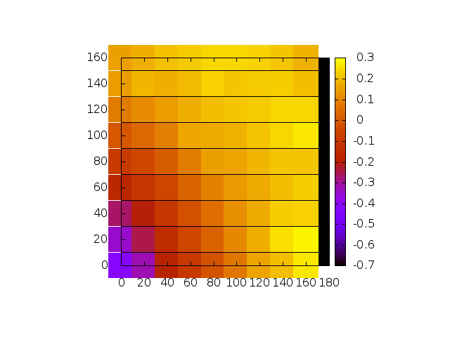

### `koppi-cnc-info.sh`

This script displays real-time parameters from the stepper motor terminals.
```bash
$ watch -n 0.1 ~/linuxcnc/configs/koppi-cnc/koppi-cnc-info.sh
```
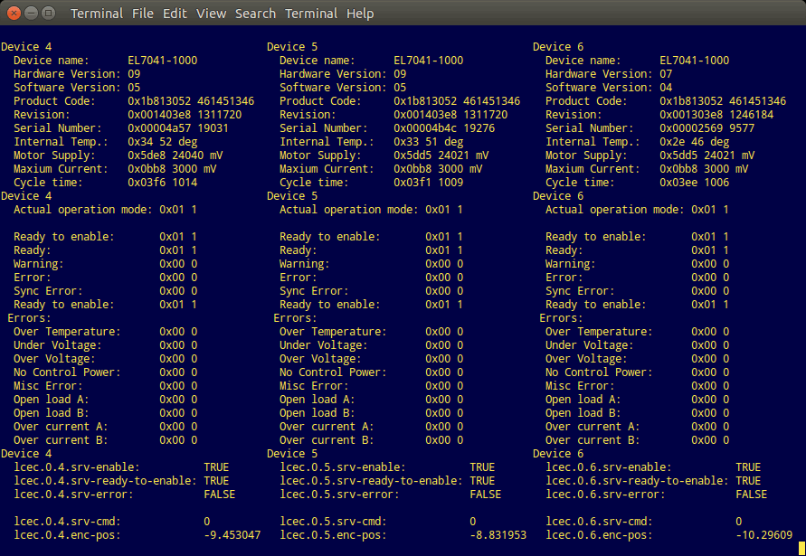

### HAL Graph Visualization

Generate a graph of the HAL connections.
```bash
$ sudo apt-get -y install python-pydot graphviz
$ ~/linuxcnc/configs/koppi-cnc/hal-graph.py
```
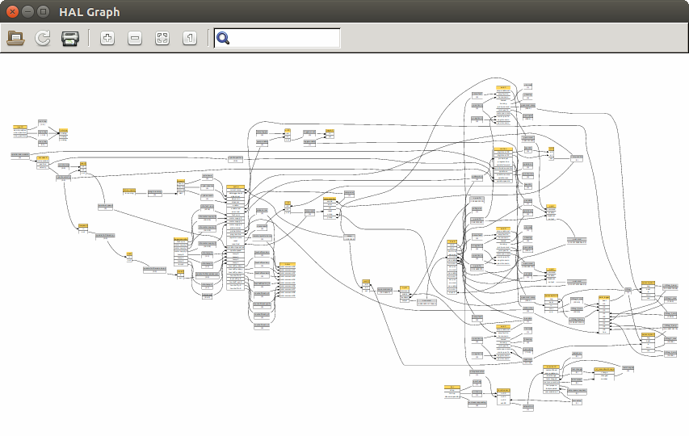
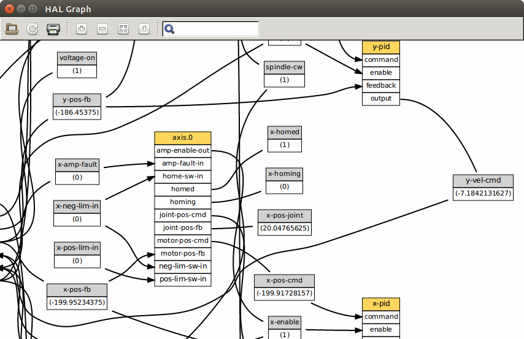

## Links

*   **Machinekit:** [Website](http://www.machinekit.io/), [Google Group](https://groups.google.com/forum/#!forum/machinekit), [GitHub](https://github.com/machinekit/machinekit/issues)
*   **LinuxCNC:** [Website](http://linuxcnc.org/), [Forum](http://linuxcnc.org/index.php/english/forum/index)
*   **EtherCAT:** [LinuxCNC EtherCAT Driver](http://wiki.linuxcnc.org/cgi-bin/wiki.pl?EtherCatDriver), [sittner/linuxcnc-ethercat](https://github.com/sittner/linuxcnc-ethercat)
*   **Xenomai Tuning:** [Estimate Clock Latency](http://jbohren.com/articles/xenomai-precise/)